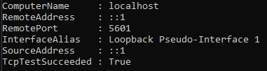

# SEG491X-T64-Capstone

## Project Overview
High-Level Diagram:

Details on [the week 6 wiki page](https://github.com/fredjkhar/SEG491X-T64-Capstone/wiki/Week-6-%E2%80%90-ELK-Stack-and-beyond)

## Installation/Setup
### Step 1: Install and configure Sysmon
1. Download Sysmon from https://learn.microsoft.com/en-us/sysinternals/downloads/sysmon
2. Navigate to where Sysmon is installed and run **with administrative priviledges** `./sysmon64.exe -accepteula -i`
3. Copy the Sysmon configuration file from the repository (`sysmon-config.xml`) to where Sysmon is installed
4. Run `./sysmon64.exe -c sysmonconfig.xml` **with administrative priviledges**
5. Sysmon is now installed and configured

### Step 2: Run Elastic and Kibana Docker mages
1. Navigate to `elk` directory
2. Run `docker-compose up -d elasticsearch` **with administrative priviledges**. This might take a while so please ensure elastic is fully operational before moving to the next step
3. To test if elastic, run `Test-NetConnection -ComputerName localhost -Port 9200`
    
4. Now run `docker-compose up -d kibana` **with administrative priviledges**
5. To test kibana, run `Test-NetConnection -ComputerName localhost -Port 5601`

6. you can now open your browser and navigate to `localhost:5601` to access kibana. You will be prompted to type a username and password.

### Step 3: Install and run Winlogbeat
1. Download Winlogbeat from https://www.elastic.co/downloads/beats/winlogbeat and unzip it. 
2. Copy the config file (`winlogbeat.yml`) to where `winlogbeat.exe` is located
3. Run `PowerShell.exe -ExecutionPolicy UnRestricted -File .\install-service-winlogbeat.ps1` **with administrative priviledges**
4. Run `.\winlogbeat.exe setup -e` **with administrative priviledges**
5. Run `Start-Service winlogbeat` **with administrative priviledges**
6. You should start seeing sysmon events being ingested by elastic

